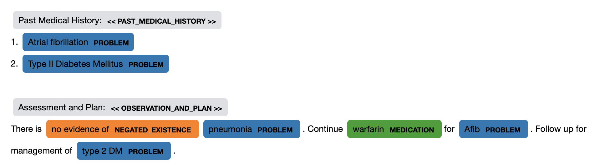

[](https://opensource.org/licenses/MIT)


# medspacy
Library for clinical NLP with spaCy. 


**MedSpaCy is currently in beta.**


# Overview
MedSpaCy is a library of tools for performing clinical NLP and text processing tasks with the popular [spaCy](https://spacy.io) 
framework. The `medspacy` package brings together a number of other packages, each of which implements specific 
functionality for common clinical text processing specific to the clinical domain, such as sentence segmentation, 
contextual analysis and attribute assertion, and section detection.

`medspacy` is modularized so that each component can be used independently. All of `medspacy` is designed to be used 
as part of a `spacy` processing pipeline. Each of the following modules is available as part of `medspacy`:
- `medspacy.preprocess`: Destructive preprocessing for modifying clinical text before processing
- `medspacy.sentence_splitter`: Clinical sentence segmentation
- `medspacy.ner`: Utilities for extracting concepts from clinical text
- `medspacy.context`: Implementation of the [ConText](https://www.sciencedirect.com/science/article/pii/S1532046409000744)
for detecting semantic modifiers and attributes of entities, including negation and uncertainty
- `medspacy.section_detection`: Clinical section detection and segmentation
- `medspacy.postprocess`: Flexible framework for modifying and removing extracted entities
- `medspacy.io`: Utilities for converting processed texts to structured data and interacting with databases
- `medspacy.visualization`: Utilities for visualizing concepts and relationships extracted from text
- `SpacyQuickUMLS`: UMLS concept extraction compatible with spacy and medspacy implemented by [QuickUMLS](https://github.com/Georgetown-IR-Lab/QuickUMLS).  More detail on this component, how to use it, how to generate UMLS resources beyond the small UMLS sample can be found in [this notebook](notebooks/11a-QuickUMLS_Extraction_Defaults.ipynb).
	- NOTE: This component is installed by default on MacOS and Linux but not Windows.  For more defails and Windows installation: [QuickUMLS on Windows](windows_and_quickumls.md)

Future work could include I/O, relations extraction, and pre-trained clinical models.

**As of 10/2/2021 (version 0.2.0.0), medspaCy supports spaCy v3**

# Usage
## Installation

You can install `medspacy` using `setup.py`:
```bash
python setup.py install
```

Or with pip:
```bash
pip install medspacy
```

To install a previous version which uses spaCy 2:
```bash
pip install medspacy==medspacy 0.1.0.2
```

### Requirements
The following packages are required and installed when `medspacy` is installed:
- spaCy v3
- [pyrush](https://github.com/medspacy/PyRuSH)

If you download other models, you can use them by providing the model itself or model name to `medspacy.load(model_name)`:
```python
import spacy; import medspacy
# Option 1: Load default
nlp = medspacy.load()

# Option 2: Load from existing model
nlp = spacy.load("en_core_web_sm", disable={"ner"})
nlp = medspacy.load(nlp)

# Option 3: Load from model name
nlp = medspacy.load("en_core_web_sm", disable={"ner"})
```
    
## Basic Usage
Here is a simple example showing how to implement and visualize a simple rule-based pipeline using `medspacy`:
```python
import medspacy
from medspacy.ner import TargetRule
from medspacy.visualization import visualize_ent

# Load medspacy model
nlp = medspacy.load()
print(nlp.pipe_names)

text = """
Past Medical History:
1. Atrial fibrillation
2. Type II Diabetes Mellitus

Assessment and Plan:
There is no evidence of pneumonia. Continue warfarin for Afib. Follow up for management of type 2 DM.
"""

# Add rules for target concept extraction
target_matcher = nlp.get_pipe("medspacy_target_matcher")
target_rules = [
    TargetRule("atrial fibrillation", "PROBLEM"),
    TargetRule("atrial fibrillation", "PROBLEM", pattern=[{"LOWER": "afib"}]),
    TargetRule("pneumonia", "PROBLEM"),
    TargetRule("Type II Diabetes Mellitus", "PROBLEM", 
              pattern=[
                  {"LOWER": "type"},
                  {"LOWER": {"IN": ["2", "ii", "two"]}},
                  {"LOWER": {"IN": ["dm", "diabetes"]}},
                  {"LOWER": "mellitus", "OP": "?"}
              ]),
    TargetRule("warfarin", "MEDICATION")
]
target_matcher.add(target_rules)

doc = nlp(text)
visualize_ent(doc)
```

`Output:`


For more detailed examples and explanations of each component, see the [notebooks](./notebooks) folder.

# Citing medspaCy
If you use medspaCy in your work, consider citing our paper! Presented at the AMIA Annual Symposium 2021, [preprint available on Arxiv](http://arxiv.org/abs/2106.07799).

```
H. Eyre, A.B. Chapman, K.S. Peterson, J. Shi, P.R. Alba, M.M. Jones, T.L. Box, S.L. DuVall, O. V Patterson,
Launching into clinical space with medspaCy: a new clinical text processing toolkit in Python,
AMIA Annu. Symp. Proc. 2021 (in Press. (n.d.). 
http://arxiv.org/abs/2106.07799.
```

```
@Article{medspacy,
   Author="Eyre, H.  and Chapman, A. B.  and Peterson, K. S.  and Shi, J.  and Alba, P. R.  and Jones, M. M.  and Box, T. L.  and DuVall, S. L.  and Patterson, O. V. ",
   Title="{{L}aunching into clinical space with medspa{C}y: a new clinical text processing toolkit in {P}ython}",
   Journal="AMIA Annu Symp Proc",
   Year="2021",
   Volume="2021",
   Pages="438--447"
}

}
```

# Made with medSpaCy
Here are some links to projects or tutorials which use medSpacy. If you have a project which uses medSpaCy which you'd like to use, let us know!
- [VA_COVID-19_NLP_BSV](https://github.com/abchapman93/VA_COVID-19_NLP_BSV): An NLP pipeline for [identifying positive cases of COVID-19](https://aclanthology.org/2020.nlpcovid19-acl.10/) from clinical text. Deployed as part of the Department of Veterans Affairs response to COVID-19
- [clinspacy](https://ml4lhs.github.io/clinspacy/index.html): An R wrapper for spaCy, sciSpaCy, and medSpaCy for performing clinical NLP and UMLS linking in R
- [mimic34md2020_materials](https://github.com/Melbourne-BMDS/mimic34md2020_materials): A crash course in clinical data science from the University of Melbourne. For medSpaCy materials, see `notebooks/nlp-*.ipynb`
- [ReHouSED NLP](https://github.com/abchapman93/ReHouSED): An NLP pipeline for [studying Veteran housing stability](https://www.sciencedirect.com/science/article/pii/S153204642100232X) and distinguishing between Veterans who are currently unstably housed and those who have exited homelessness
